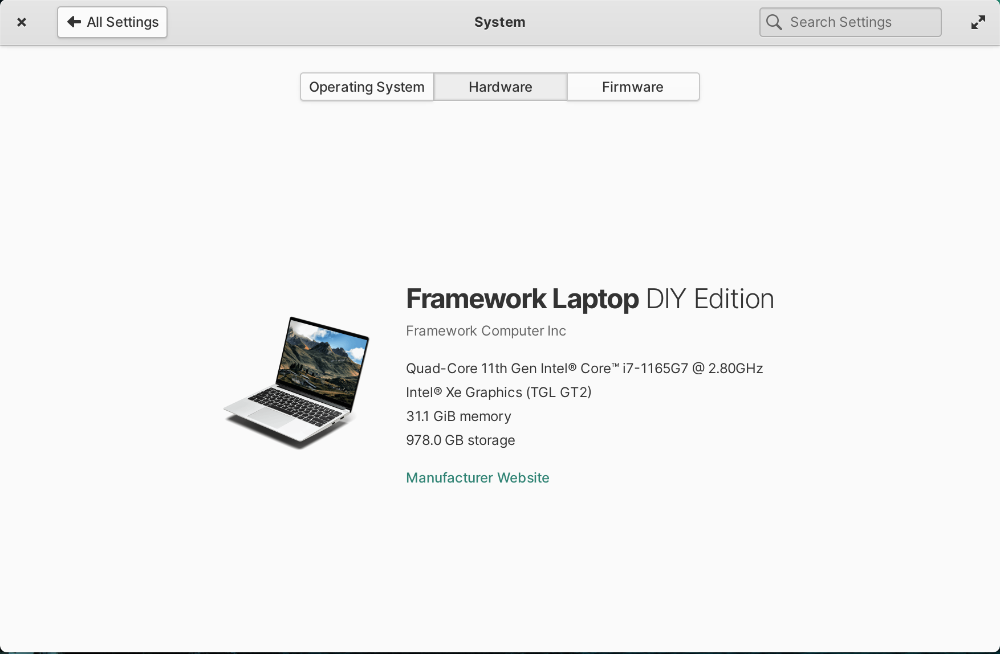
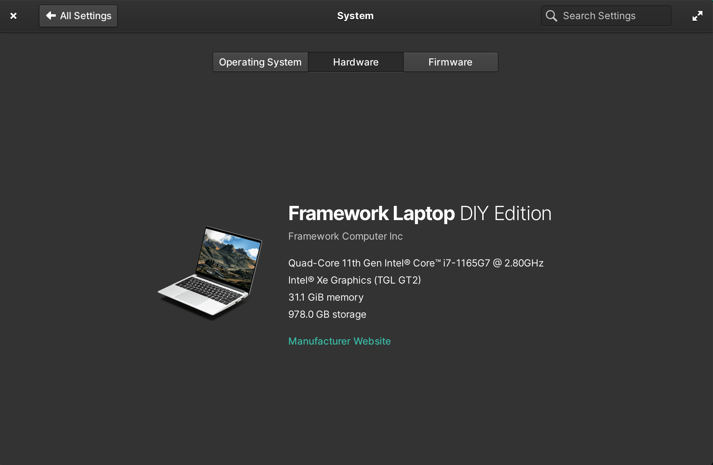

# elementary-os-framework

Configuration for elementary os on a frame.work DIY laptop

## [oem-info](oem-info) 

OEM info for elementary OS System Settings

> Attribution for this copy goes to [cassidyjames/oem-info](https://github.com/cassidyjames/oem-info/blob/fe07f3c9a25416d24fa6a31357eb98f9ce69fefb/README.md) and its contributors.

The [oem-info/ folder](oem-info)  copies the [Framework/Laptop DIY Edition](https://github.com/cassidyjames/oem-info/tree/main/Framework/Laptop%20DIY%20Edition) folder and its README.md.

 | 
------------------------------|----------------------------------------