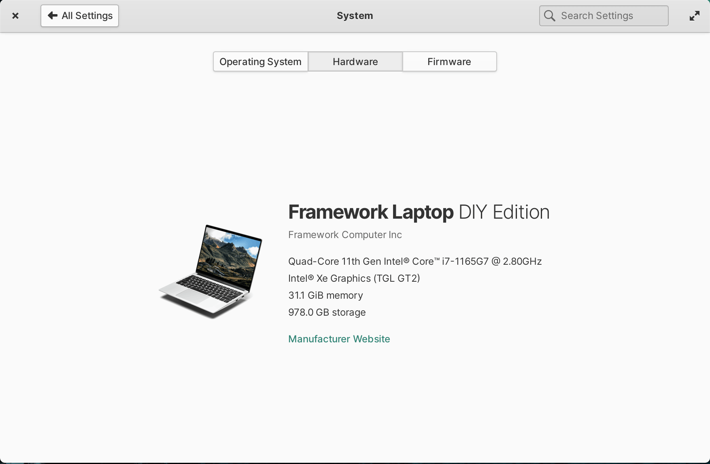

# elementary-os-framework

Configuration for [elementary os](https://elementary.io/) on a [Framework DIY laptop](https://frame.work/).

## [oem-info](oem-info) 

OEM info for elementary OS System Settings

> Attribution for this copy goes to [cassidyjames/oem-info](https://github.com/cassidyjames/oem-info/blob/fe07f3c9a25416d24fa6a31357eb98f9ce69fefb/README.md) and its contributors.

The [oem-info/ folder](oem-info)  copies the [Framework/Laptop DIY Edition](https://github.com/cassidyjames/oem-info/tree/main/Framework/Laptop%20DIY%20Edition) folder and its README.md.

 | 
------------------------------|----------------------------------------

## [xrandr](xrandr)

This folder contains a [xrandr.sh](xrandr.sh) script that can be placed in `/etc/profile.d/`.

> Alternatively you can copy it to your `~/.profile` if you want it to just be for that user, and not [machine wide](https://community.frame.work/t/using-elementary-os-on-the-framework-laptop/4453/11).

The purpose of the script is to [set the resulution of the display to a 3x2 aspect ratio](https://community.frame.work/t/using-elementary-os-on-the-framework-laptop/4453), for all users, while suppressing normal output.  The suppressing of normal output is so that zsh or bash terminal sessions do not have any output displayed while the terminal is loading.  Additionally, the script checks (with `grep`) to see if the display setting exists in xrandr's output, and only adds it if it hasn't been added.  I did this with grep as I didn't see any list mode commands in `xrandr --help`, and my solution solved the problem sufficiently for me.
